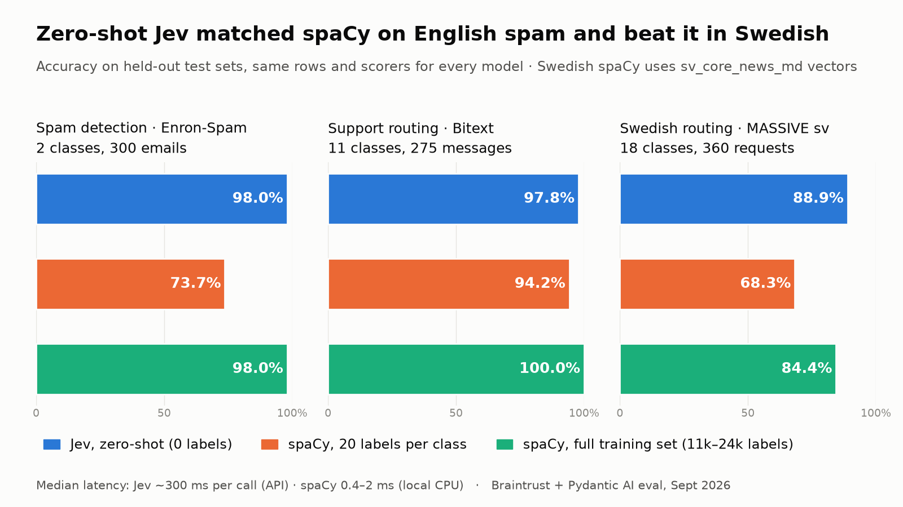

# Email classifier bake-off: spaCy vs Jev vs Claude

A [Braintrust](https://www.braintrust.dev/docs/evaluate) eval that runs three kinds of classifier on the same
two email tasks, the same test rows and the same deterministic scorers:

| contestant | what it is | needs |
|---|---|---|
| `spacy` | spaCy `textcat` (bag-of-bigrams + small CNN ensemble), trained on the task's own labelled data, local CPU | nothing |
| `spacy-20shot` | the same pipeline trained on only 20 labelled examples per class | nothing |
| `jev` | [TypeSafe Jev](https://pydantic.dev/docs/ai/models/typesafe/), a System One decision model, zero-shot | `TYPESAFE_API_KEY` |
| `claude` | Claude Opus 5 via structured output at `effort=low`, zero-shot, the same schema Jev reads | `ANTHROPIC_API_KEY` |

| task | data | test set |
|---|---|---|
| `spam` | [Enron-Spam](https://huggingface.co/datasets/SetFit/enron_spam): real corporate mail, ham/spam | 150 spam + 150 ham, from the official test split |
| `route` | [Bitext customer support](https://huggingface.co/datasets/bitext/Bitext-customer-support-llm-chatbot-training-dataset): 11 categories | 25 per category |
| `scenario_sv` | [MASSIVE, Swedish](https://huggingface.co/datasets/mteb/amazon_massive_scenario) (human-localised voice-assistant requests): 18 scenarios | 20 per scenario |

For Swedish, spaCy uses its Swedish tokenizer and the pretrained 300-dimensional word vectors from
`sv_core_news_md` (`configs/textcat_sv.cfg`). The Swedish criteria in `labels.py` are written in English.
I found no public Swedish spam corpus, so Swedish covers routing only.

## Run it

```bash
uv sync
uv run python data.py                    # download + split both datasets into data/
uv run python train_spacy.py             # ~6 min CPU: models/spam, models/route
uv run python train_spacy.py --shots 20  # ~6 min CPU: models/*-20shot (each task, incl. scenario_sv)
uv run pytest -q                         # offline: Jev and Claude paths against fakes

export BRAINTRUST_API_KEY=... TYPESAFE_API_KEY=... ANTHROPIC_API_KEY=...
LIMIT=5 uv run braintrust eval --no-send-logs eval_email.py  # smoke test, 5 rows per class
uv run python eval_email.py                                  # the real run, logged to Braintrust
```

Run the file with `python`, not `braintrust eval`, for the real run: the `braintrust eval` CLI (0.41) ignores
`base_experiment_name`, so every experiment would be diffed against whichever ran last instead of against spaCy.
Each full run logs about 3,900 scores; this account's Braintrust plan caps at 11,000 a month.

A contestant whose key is missing is skipped, so `--no-send-logs` with no keys at all still runs spaCy.
Useful env vars (or a `.env` file, see `settings.py`): `JEV_MODEL` (default `typesafe:jev-latest`, pin e.g. `typesafe:jev-1.13.0` for
reproducible runs), `LLM_MODEL` (default `anthropic:claude-opus-5`), `LIMIT`, `CONCURRENCY`,
`BRAINTRUST_PROJECT`.

In Braintrust, each `(task, contestant)` pair is its own experiment (`spam-jev`, `route-spacy`, and so on)
in one project. Compare any two to see them row by row. Per-row metadata holds the model version,
Jev's per-option probabilities and confidence, spaCy's class probabilities, and token counts. Latency is
the task span's duration.

## Scores

`accuracy` plus `recall · <class>` for every class, and `precision · spam` for the spam task. They are
deterministic comparisons against the gold label, not an LLM judge. Braintrust averages each score over
the rows that produced it, so a recall that is only scored on rows of its class gives true per-class
recall, and `precision · spam`, only scored on rows predicted spam, gives true precision.

## Results (2026-09-21, full test sets; Claude not run)




| | spam acc | spam recall | spam precision | route acc | p50 latency | p95 latency |
|---|---|---|---|---|---|---|
| spaCy, full training split (12k / 23.6k rows) | 98.0% | 96.7% | 99.3% | 100% | 0.4–2 ms | 0.5–8 ms |
| spaCy, 20 labelled per class | 73.7% | 61.3% | 81.4% | 94.2% | 0.4–2 ms | 0.4–8 ms |
| **Jev, zero-shot** (`jev-latest`) | **98.0%** | **97.3%** | **98.6%** | **97.8%** | ~300 ms | ~375–400 ms |
| Claude Opus 5, zero-shot | – | – | – | – | – | – |

**Swedish (`scenario_sv`, 360 test requests, not logged to Braintrust: the month's score quota was used up)**

| | accuracy | p50 latency |
|---|---|---|
| spaCy + `sv_core_news_md` vectors, full training split (11k) | 84.4% | 0.4 ms |
| spaCy + `sv_core_news_md` vectors, 20 labelled per class | 68.3% | 0.4 ms |
| **Jev, zero-shot** (English criteria, Swedish text) | **88.9%** | ~306 ms |

Jev beat even the fully trained Swedish spaCy model here. At confidence ≥ 0.8 (85% of requests) it
scored 94.4%. Most errors involve MASSIVE's catch-all `general` class and the `play`/`music` overlap,
where the dataset's own labels are ambiguous. The descriptions were not tuned: dev accuracy was 88.1%
before any changes, and its errors showed no pattern worth fixing. spaCy here is the small CPU
ensemble; a transformer pipeline (e.g. KB-BERT through `spacy-transformers`) would likely close part
of the gap, at a much higher cost to run.

Latency is the wall time around each call from a laptop (network included), 8 requests at a time.
spaCy runs in-process on CPU.

- **Spam:** Jev with zero labels matches spaCy trained on 12,000 labelled emails. The 6 emails it got
  wrong had a mean confidence of 0.24. At confidence ≥ 0.8 it made no mistakes, and 77% of emails cleared
  that bar, so a "send low-confidence mail to review" policy is realistic.
- **Routing:** 97.8% zero-shot, against 94.2% for spaCy with 20 labels per class. At confidence ≥ 0.8
  (97% of messages) it scored 99.3%. Most of the remaining errors are "when will my order arrive?" type
  messages, which sit between `order` and `delivery` in Bitext's own labels.
- **How the category descriptions were tuned:** the first descriptions gave 93.5% on test. Its errors
  were three consistent confusions (withdrawal fees → payment, consumer claim → refund, arrival time →
  order), so I revised four descriptions *on the dev split* (93.0% → 98.4%) and then scored the test
  set once. The test set was not used to choose the wording.

## Jev labels, spaCy learns (`distill.py`)

Can Jev replace human labelling, so the deployed model is local spaCy with no external calls? For
each routing task, `distill.py` draws a random pool of 2,000 training messages (labels ignored), has
Jev label them, and trains spaCy on the same pool three ways: gold labels, all Jev labels, and only Jev
labels with confidence ≥ 0.8. Every model is selected on the same small gold dev split and scored on
the same test set.

| | English routing (Bitext) | Swedish routing (MASSIVE sv) |
|---|---|---|
| Jev's labels on the pool: agreement with gold | 97.9% | 88.0% (95.6% on the 83% at confidence ≥ 0.8) |
| spaCy, 2,000 **gold** labels | 99.6% | 76.4% |
| spaCy, 2,000 **Jev** labels | 97.8% | 76.9% |
| spaCy, **Jev labels at confidence ≥ 0.8** | 96.7% (1,951 rows) | 78.6% (1,666 rows) |
| *for reference:* Jev itself, zero-shot | 97.8% | 88.9% |
| *for reference:* spaCy, full gold training split | 100% | 84.4% |

- **Jev's labels are as good as human labels for training spaCy.** On Swedish, Jev labels matched or
  beat gold labels from the same pool (76.9% and 78.6% against 76.4%). On English they came within
  2 points. The student model runs in about 1 ms, locally, with no text leaving the machine.
- **The student learns the teacher's mistakes.** The English Jev-trained models make Jev's own error
  (`order → delivery`, 4 of 275) and none of the gold-trained model's.
- **Filtering on confidence helps when the teacher is less sure.** It gained 1.7 points on Swedish,
  where 17% of Jev's labels were below 0.8. It made no real difference on English (3 rows, within noise).
- **For Swedish, pool size was the bottleneck, not label quality.** So the next run labelled the whole
  Swedish training split (10,957 messages; Jev agreed with gold on 87.9%):

| Swedish routing, 360 test requests | pool of 2,000 | full split, 10,957 |
|---|---|---|
| spaCy, gold labels | 76.4% | 82.8% |
| spaCy, Jev labels | 76.9% | **82.5%** |
| spaCy, Jev labels at confidence ≥ 0.8 | 78.6% | 80.3% (9,075 rows) |

  At full size, Jev labels match gold labels (0.3 points, one test row). The noise floor is about
  ±2 points: `spacy` and `spacy-gold10957` train on the same 10,957 gold rows in a different order and
  score 84.4% vs 82.8%. The confidence filter's effects (+1.7 at 2,000, −2.2 at 10,957) are inside that
  band, but at full size it removes 17% of the data, mostly from the hard classes (`general`, `qa`,
  `music`), so there is no reason to use it when data is plentiful. The student (82.5%) still trails
  Jev (88.9%): the bottleneck is now the small CPU model, not the labels.

## Data protection: what Jev sends, and where (a DPO question)

**Every Jev call sends the message text, in full, to TypeSafe in the US.** This is the request body
the SDK sends for one spam check. It was captured offline with a mock transport, so nothing left the
machine:

```json
POST https://api.typesafe.ai/v1/systemone
{
  "state": "Hej Anna, bifogar fakturan för september. Mvh Erik, erik@example.se",
  "model": "jev-latest",
  "questions": {
    "is_spam": {
      "type": "noul",
      "instructions": {
        "field": "is_spam",
        "question": "Is this unsolicited bulk email (advertising, scams, phishing or adult content) rather than ...",
        "goal": "Screen an email that arrived in an employee's corporate inbox."
      }
    }
  }
}
```

- `state` is the email text as-is: names, addresses, amounts, anything in it. This project cuts it at
  3,000 characters. Attachments and headers are not sent unless you put them in the text.
- `questions` is your schema (docstrings, field and category descriptions).
- The HTTP headers carry your API key and the SDK, Python and OS versions.

What TypeSafe's [privacy policy](https://typesafe.ai/legal/privacy-policy) says (read 2026-09-22):

- **Hosting:** "The Services are hosted in the United States". Use from the EEA is a transfer of
  personal data to the US.
- **Training:** "We will not train or fine tune any artificial intelligence or machine learning models
  on your prompts or other Input."
- **Retention:** "as long as reasonably necessary to provide you with the Services, or otherwise in
  support of our business or commercial purposes". The policy mentions no zero-retention option.
  Third-party write-ups report zero data retention on the enterprise tier only.
- **Sharing:** input is not disclosed to third parties "other than our service providers". The policy
  gives no list of subprocessors and names no SCCs or DPA.
- **Self-hosting:** none. Jev is a closed, hosted API in early access, with no on-premise or open-weight
  option published.

So sending real email through Jev is a GDPR decision for your DPO, not only an engineering one. At a
minimum it needs a DPA, a transfer mechanism for US processing, and a retention agreement. Ways to
keep the text in-house, from strictest to loosest:

1. **spaCy only:** nothing leaves the machine. Needs labelled data.
2. **Jev only at training time (`distill.py`):** Jev labels a training pool once, and production
   runs spaCy locally with no external calls. On Swedish this matched human labels (82.5% vs 82.8%).
   Label a pool that is already public, synthetic or pseudonymised, and no real mail ever leaves.
3. **Pseudonymise before each call:** replace names, addresses and numbers with placeholders first
   (spaCy's `sv_core_news_*` NER finds Swedish names). Categorisation rarely depends on who wrote the
   mail, but this reduces the personal data sent rather than removing it.

## What this can and cannot tell you

- **The real question is zero-shot vs labelled data.** With thousands of in-domain labels, a trained
  spaCy model is extremely hard to beat, and it costs nothing and answers in about a millisecond. Jev's case is
  the cold start: no labels yet, a label set that changes, or text unlike the training data. Compare Jev
  against `spacy-20shot`. For a full learning curve, train `--shots 50`, `--shots 200` and so on; each one
  becomes a contestant automatically.
- **`route` is near its ceiling.** Bitext messages come from templates, so a supervised model reaches 100%.
  It still separates the zero-shot contestants, and for them the category descriptions in `labels.py`
  are the prompt: wording them well was worth about 4 points of accuracy.
- **Enron is 2000-era mail**, lower-cased and tokenised by the dataset (`re : meeting`). The spam
  templates of that era repeat, so near-duplicates across train and test help spaCy. Exact duplicates
  are removed. Zero-shot models get no such help.
- **Same input for everyone:** each text is cut to 3,000 characters, and Jev and Claude get the same
  schema (the docstring is the goal, the field description is the question, each option's description is
  its criterion). Neither gets extra prompt text.
- **Jev's `bool` answers use a 0.5 threshold** (`typesafe_boolean_threshold`). Raise it for fewer false
  positives, lower it for fewer misses. Its confidence per field is in each row's metadata.

## Files

- `labels.py`: label sets and the Pydantic schemas (Jev's and Claude's prompt)
- `records.py`: Pydantic models for every JSONL file under `data/`, validated on read and write
- `settings.py`: typed run configuration from env vars or `.env` (pydantic-settings)
- `data.py`: builds deterministic, de-duplicated, stratified splits into `data/`
- `train_spacy.py` + `configs/textcat.cfg`: spaCy training, full or `--shots N`
- `contestants.py`: the tasks each contestant exposes
- `scorers.py`: accuracy, per-class recall, spam precision
- `eval_email.py`: the Braintrust entry point
- `distill.py`: Jev labels an unlabelled pool, and spaCy trains on those labels
- `test_pipeline.py`: offline tests with a fake TypeSafe client and a mocked Anthropic transport

## License

MIT, see [LICENSE](LICENSE). The datasets keep their own licenses: Enron-Spam, Bitext customer support and MASSIVE are downloaded from Hugging Face by `data.py` and are not redistributed here.
